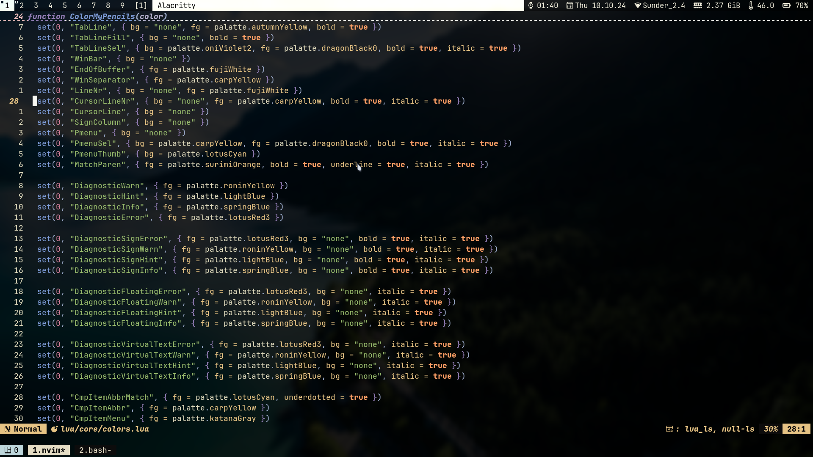

#  Dotfiles
There are my dotfiles.
Feel free to copy any script or config files.\
Custom Scripts avalible in "shellScripts" dir

# My Setup
* OS: Debian
* Window Manager: DWM
* Compositer: picom
* Shell: Bash
* bin/sh: dash
* Prompt: 
    - bash: starship
    - zsh: powerlevel10k
* Terminal: Alacritty
* Application Launcher: Rofi
* Editor: Neovim
* File Manager: Vifm
* Notification Daemon: Dunst
* Image Viewer: feh
* Video Player: mpv
* PDF/EPUB: zathura
* Lock: i3lock

# Screenshots
*Alacritty*

*Rofi*

*Rofi Power Menu (custom script)*

*Top in ST*

*Vifm*

*Zsh*

*Neovim and Tmux*

*Dunst*

